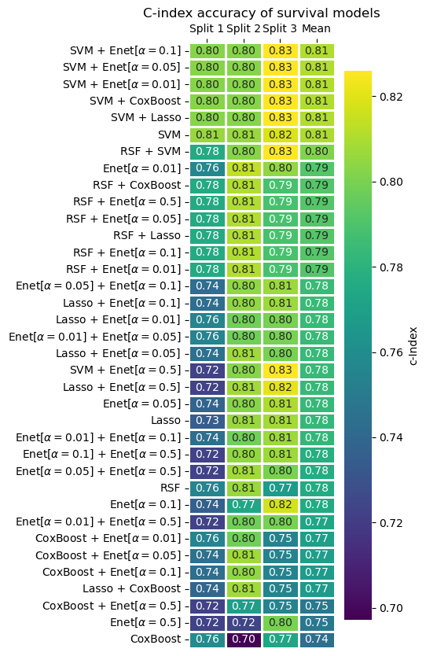
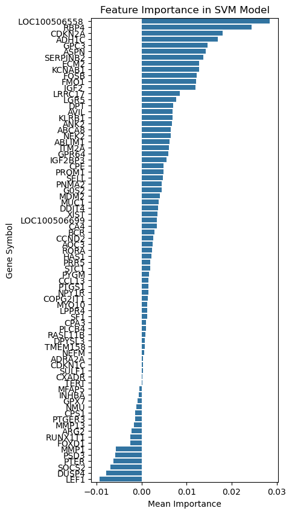
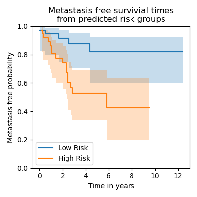

# Final project for BF500 
## Foundations of Programming, Data Analytics, and Machine Learning in Python

In this project, I am recreating figures from a paper of my choosing, with an emphasis on Python and machine learning methods. I have chosen to reproduce results from Chenhe et al., 2025, specifically Figure 4, in which the researchers evaluate several machine-learning survival models to predict the time to metastasis in liposarcoma tumors using RNA microarray data.

## Background

Liposarcoma is a rare type of cancer that originates in fat cells. It is often associated with exposure to toxic chemicals, as fatty tissues can accumulate lipophilic compounds such as TCDD. This analysis aims to identify key genes that drive more aggressive forms of this cancer.

## Methods
#### Data Acquisition
Gene expression microarray data were obtained from the NIH Gene Expression Omnibus. Three datasets, GSE21050, GSE30929, and GSE71118, were used. Keeping only liposarcoma samples yielded 247 cases, in contrast to the 192 samples reported in the paper
#### Data Normalization
Datasets were combined and transformed into log2 scale when not already in that format. They were then batch‑corrected using the InMoose Python implementation of ComBat (Johnson et al., 2007).
#### Initial Feature Selection
In a departure from the paper, which used Maximal Information Coefficient (MIC), to remove non-relevent probes, I followed the protocol outlined in the R Mime package. Feature selection was performed using univariate Cox regression, selecting probes with p-values of 0.05 or less. This was done using the lifelines package (Davidson-Pilon, 2019). This step reduced the original 22,215 probes to 6,150, a 72% reduction in feature size. 
#### Model Comparison
The data was split into a 70% training and 30% testing set. Sixteen different survival models were tested using three‑fold cross‑validation with the scikit‑survival package (Pölsterl, 2020). 
Multivariate Feature Selection
Additional feature selection was carried out using an Elastic Net regression model. The Elastic Net hyperparameter alpha was first optimized through three‑fold cross‑validation.
The optimized model was then fit to a randomized 90% subsample of the training data 100 times. Probes selected at least 20 times were considered prognostically relevant, reducing the feature set to 82 probes.
#### Feature Importance
Elastic Net coefficients indicate probe relevance but lack a solid statistical interpretation. To estimate importance, the top-performing model, SVM, was retrained using the selected 82 probes. Feature importance was then determined using the permutation importance method from scikit‑learn (Pedregosa et al., 2011), which measures the drop in model performance when individual feature values are shuffled. The results for each gene were reported as the mean of all associated probes. 

## Results
#### Model Evaluation

    
    

In this section, I attempted to recreate Figure 4A from Zhang et al. (2025). To do so, 36 liposarcoma metastasis‑free survival models were evaluated with 3‑fold cross‑validation and ranked by mean concordance index (c‑index). The c‑index is a metric for survival models that ranges from 0 to 1. Higher values indicate stronger predictive performance; a value of 0.5 suggests the model performs no better than random chance.
Based on the c‑index, the Survival Support Vector Machine (SVM) and all the ensemble methods that incorporated SVM tied for the top‑ranking model, with a mean score of 0.81. After refitting the top model (SVM + Enet α=0.1) to the full training dataset, its performance on the 30% test set was 0.80. This is higher than the paper’s reported SVM performance of 0.67 and even higher than their top model (LASSO + RSF), which achieved 0.75.

#### Feature Importance
I next attempted to recreate Figure 4B, which plots “variable importance” in their RSF model. Variable importance can be estimated through internal model metrics or through model‑agnostic permutation methods. Based on their reported values, I suspect they used permutation importance, and I adopted the same process.
However, computing permutation importance for all 6,150 probes was too computationally intensive, requiring additional feature reduction. Replicating the standard Mime pipeline, I replicated their approach of repeatedly applying regularized regression and selecting consensus features. I optimized an Elastic Net model and ran it 100 times on randomized training subsets, keeping probes chosen at least 20 times. This produced 82 core probes.
These 82 probes were then used to refit the SVM model, with no decrease in accuracy as measured by the c-index. Feature importance was calculated using permutation tests on the testing dataset.

#### Kaplan–Meier Survival Curves

A risk score for each patient in the test dataset was computed using the 82‑probe SVM model. Patients were divided into high‑ and low‑risk cohorts, and Kaplan–Meier survival curves were plotted.
A clear separation emerged between groups: the high‑risk cohort had roughly a 60% chance of metastasis after 7 years, while the low‑risk group had only a 20% chance.

## References
 Z. Chenhe et al., **“Integrating machine learning and molecular dynamics simulation to decipher the molecular network of dioxin-associated liposarcoma,”** Sci Rep, vol. 15, no. 1, p. 40072, Nov. 2025, doi: 10.1038/s41598-025-25116-y.

Chenhe, Z., Aobo, Z., Xiao, Z., Han, G., Longshang, W., Zhe, X., Yingxue, C., Huichen, L., Jincheng, W., Wei, Z., & Wengang, L. (2025). **Integrating machine learning and molecular dynamics simulation to decipher the molecular network of dioxin-associated liposarcoma.** Scientific Reports, 15(1), 40072. https://doi.org/10.1038/s41598-025-25116-y

Davidson-Pilon, C. (2019). **lifelines: Survival analysis in Python.** Journal of Open Source Software, 4(40), 1317. https://doi.org/10.21105/joss.01317

Johnson, W. E., Li, C., & Rabinovic, A. (2007). **Adjusting batch effects in microarray expression data using empirical Bayes methods.** Biostatistics, 8(1), 118–127. https://doi.org/10.1093/biostatistics/kxj037

Liu, H., Zhang, W., Zhang, Y., Adegboro, A. A., Fasoranti, D. O., Dai, L., Pan, Z., Liu, H., Xiong, Y., Li, W., Peng, K., Wanggou, S., & Li, X. (2024). **Mime: A flexible machine-learning framework to construct and visualize models for clinical characteristics prediction and feature selection**. Computational and Structural Biotechnology Journal, 23, 2798–2810. https://doi.org/10.1016/j.csbj.2024.06.035

Pedregosa, F., Varoquaux, G., Gramfort, A., Michel, V., Thirion, B., Grisel, O., Blondel, M., Prettenhofer, P., Weiss, R., Dubourg, V., Vanderplas, J., Passos, A., Cournapeau, D., Brucher, M., Perrot, M., & Duchesnay, É. (2011). **Scikit-learn: Machine Learning in Python.** Journal of Machine Learning Research, 12(85), 2825–2830.

Pölsterl, S. (2020). **scikit-survival: A Library for Time-to-Event Analysis Built on Top of scikit-learn.** Journal of Machine Learning Research, 21(212), 1–6.

